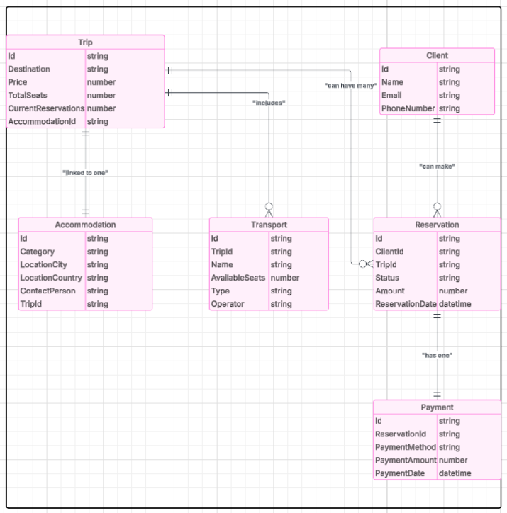

# Travel Agency Reservation System

## Task Description
The objective of this task is to design and implement a database system for a travel agency to manage their reservations efficiently. The system should provide the following functionalities:

1. **Reservation Management**:  
   - Clients can book trips.  
   - Reservations include details such as status (Pending, Confirmed, or Cancelled), amount and reservation date.  

2. **Payment Processing**:  
   - Clients can pay for reservations using predefined methods such as Credit Card or PayPal.  
   - The system should record payment details including payment method, amount and payment date.  

3. **Trip Management**:  
   - Trips include details like destination, price, number of available seats and current reservations.  
   - The system should support a variety of transport options (Bus, Plane, Train), each with associated details such as name, type, available seats and operator.  

4. **Accommodation Management**:  
   - Each trip includes a single accommodation option.  
   - Accommodation details include category, location (city and country) and a contact person.

## Solution
The system is modeled using an Entity-Relationship Diagram (ERD). Below are the main entities and their attributes:

### 1. Entities and Attributes
- **Client**:
  - `ClientID` (Primary Key)
  - Name
  - Email
  - PhoneNumber

- **Trip**:
  - `TripID` (Primary Key)
  - Destination
  - Price
  - TotalSeats
  - CurrentReservations
  - `AccomodationID` (Foreign Key referencing Accomodation)

- **Reservation**:
  - `ReservationID` (Primary Key)
  - Status
  - Amount
  - ReservationDate
  - `ClientID` (Foreign Key referencing Client)
  - `TripID` (Foreign Key referencing Voyage)

- **Payment**:
  - `PaymentID` (Primary Key)
  - PaymentMethod
  - PaymentAmount
  - PaymentDate
  - `ReservationID` (Foreign Key referencing Reservation)

- **Transport**:
  - `TransportID` (Primary Key)
  - Name
  - AvailableSeats
  - Type
  - Operator
  - `TripID` (Foreign Key referencing Trip)

- **Accommodation**:
  - `AccommodationID` (Primary Key)
  - Category
  - LocationCity
  - LocationCountry
  - ContactPerson
  - `TripID` (Foreign Key referencing Trip)

### 2. Relationships
- A **Client** can make multiple **Reservations** (1:N).
- A **Trip** can have multiple **Reservations** (1:N).
- Each **Reservation** has one **Payment** (1:1).
- A **Trip** can include multiple **Transport** options (1:N).
- A **Trip** is linked to one **Accommodation** (1:1).

### 3. Chart
